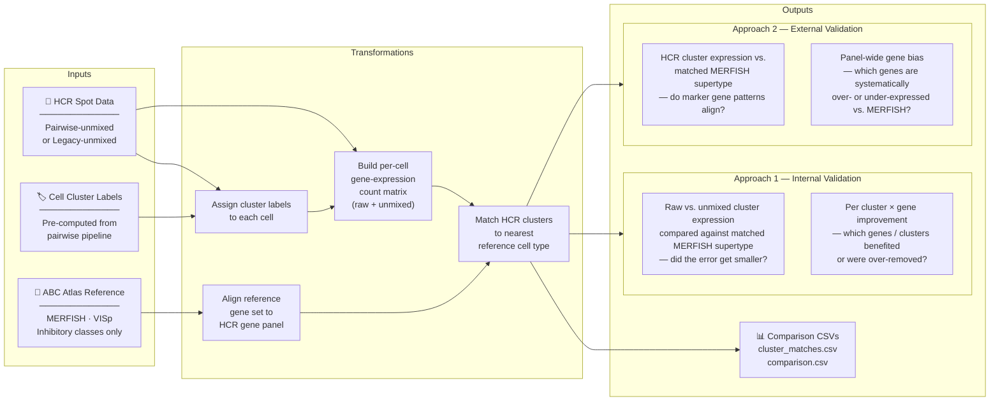
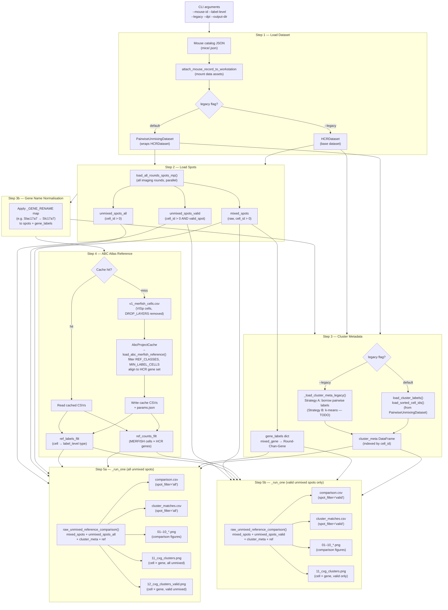

# Atlas-Comparison Pipeline: Workflow Documentation

> Generated from `run_atlas_compare.py` — covers both **pairwise** (default) and **legacy** modes.

---

## Overview

This pipeline validates HCR (Hybridization Chain Reaction) cell clustering against the Allen Brain Cell (ABC) Atlas MERFISH reference for primary visual cortex (VISp).  For each mouse it:

1. Loads experimental HCR spot data (either from a pairwise-unmixed or a legacy-unmixed dataset).
2. Assigns each cell a cluster label derived from the pairwise unmixing pipeline.
3. Builds a per-cell gene-expression count matrix from those spots (both raw and unmixed).
4. Loads a curated subset of the ABC Atlas MERFISH reference (VISp, inhibitory classes only).
5. Runs two complementary validation approaches:
   - **Approach 1 — Internal validation:** Did spectral unmixing move expression *closer* to the reference? Compares raw vs. unmixed cluster-averaged expression against the matched MERFISH supertype (Figs 08/09 scatter, Fig 10 error improvement, Fig 02 per-cluster×gene heatmap).
   - **Approach 2 — External validation:** Does the unmixed profile *match* the reference at all? Checks whether HCR cluster expression looks like its matched MERFISH supertype independent of the raw data (Fig 03 expression heatmap with difference panel, Figs 06/07 panel-wide gene bias plots).
6. Saves CSVs (`comparison.csv`, `cluster_matches.csv`) and all figures for downstream review.

The script is invoked for one mouse at a time; `run_all_mice.sh` loops over a fixed list.

---

## Inputs

| Input | Type | Location | Notes |
|---|---|---|---|
| Mouse catalog JSON | JSON file | `/src/ophys-mfish-dataset-catalog/mice/<mouse_id>.json` | Defines raw rounds, derived assets, and metadata |
| HCR raw spot data | Parquet/CSV per round | Mounted from catalog, under `DATA_DIR` | Loaded as `mixed_spots` via `load_all_rounds_spots_mp` |
| Pairwise-unmixed spot data | Parquet/CSV per round | `DATA_DIR/<pairwise_unmixing_asset>/` | Loaded as `unmixed_spots` |
| Pre-computed cluster labels | `.npy` / binary | Inside pairwise asset | `load_cluster_labels()` + `load_sorted_cell_ids()` |
| V1 MERFISH cell index | CSV | `/root/capsule/code/v1_merfish_cells.csv` | Pre-filtered to VISp cells; used as cell index for reference |
| ABC Atlas MERFISH counts | HDF5 / cache | `/root/capsule/data/abc_atlas/` | Allen Brain Cell Atlas; accessed via `AbcProjectCache` |

---

## Key Decision Variables (CLI + Constants)

| Variable | Where set | Effect |
|---|---|---|
| `--mouse-id` | CLI (required) | Selects catalog JSON and all downstream data |
| `--label-level` | CLI (default: `supertype`) | Granularity of reference labels used for matching: `class`, `subclass`, `supertype`, or `cluster` |
| `--legacy` | CLI flag | Loads base `HCRDataset` instead of `PairwiseUnmixingDataset`; appends `-legacy` to `mouse_id` in CSV outputs |
| `--output-dir` | CLI (default: `scratch/ref_atlas_validation/<mouse_id>`) | Root of all output files |
| `--dpi` | CLI (default: `150`) | Figure resolution |
| `DROP_LAYERS` | Constant (`["VISp6a", "VISp6b"]`) | Deep cortical layers excluded from the V1 MERFISH reference |
| `REF_CLASSES` | Constant (`["07 CTX-MGE GABA", "06 CTX-CGE GABA"]`) | ABC Atlas inhibitory cell classes included in the reference |
| `MIN_LABEL_CELLS` | Constant (`10`) | Minimum cells per reference label; sparse labels are dropped |

---

## Step-by-step Transformations

### Step 1 — Load Dataset (`_load_data`)

- Reads `<mouse_id>.json` from the catalog.
- Attaches all data assets to the workstation (mounts S3 / local paths).
- **Default (pairwise) mode:** Resolves the `pairwise_unmixing` derived asset path, instantiates a `PairwiseUnmixingDataset` wrapping the base `HCRDataset`.
- **Legacy mode (`--legacy`):** Returns the base `HCRDataset` directly; pairwise asset is not used for spot loading.

### Step 2 — Load Spots (`_load_spots`)

- Loads all imaging rounds in parallel (`load_all_rounds_spots_mp`):
  - `mixed_spots`: raw (pre-unmixing) spot assignments per cell and channel.
  - `unmixed_spots`: spectrally-unmixed spot assignments, with a `valid_spot` flag.
- Applies **cell assignment filter**: drops spots with `cell_id == 0` (unassigned to any cell).
- Splits unmixed spots into two subsets:
  - `unmixed_spots_all`: all assigned unmixed spots (no quality filter).
  - `unmixed_spots_valid`: assigned unmixed spots where `valid_spot == True`.

### Step 3 — Cluster Metadata (`_load_cluster_meta` / `_load_cluster_meta_legacy`)

- **Default mode:** Calls `pw_ds.load_cluster_labels()` and `pw_ds.load_sorted_cell_ids()` directly from the pairwise dataset. Builds a `DataFrame` indexed by `cell_id` with a `cluster_label` column.
- **Legacy mode:** Strategy A — instantiates the pairwise dataset solely to borrow its pre-computed cluster labels and cell IDs; no spot data is loaded from the pairwise asset. (Strategy B — k-means re-clustering from legacy spots — is stubbed for future implementation.)
- Also derives `gene_labels` dict mapping `mixed_gene → "Round-Chan-Gene"` display strings from `mixed_spots`.

### Step 4 — Gene Name Normalisation

- Applies a known typo correction: `"Slac17a7"` → `"Slc17a7"` across `mixed_spots`, `unmixed_spots_all`, `unmixed_spots_valid`, and `gene_labels`.

### Step 5 — Load ABC Atlas Reference (`_load_abc_reference`)

- Computes a **cache key** (MD5 hash of `label_level` + `REF_CLASSES` + `MIN_LABEL_CELLS` + sorted HCR gene list).
- If the cache exists on disk (`_ref_cache/<label_level>_<hash>/`), loads CSVs directly (fast path).
- Otherwise, loads the full MERFISH metadata from `AbcProjectCache`, then calls `atlas_compare.load_abc_merfish_reference` to:
  - Subset to `v1_merfish_cells` (VISp, excluding `DROP_LAYERS`).
  - Filter to `REF_CLASSES` (inhibitory lineages only).
  - Drop reference labels with fewer than `MIN_LABEL_CELLS` cells.
  - Align gene columns to the HCR gene set.
- Returns:
  - `ref_counts_filt`: MERFISH expression count matrix (cells × genes), aligned to HCR genes.
  - `ref_labels_filt`: Series of reference cell-type labels, indexed by cell.

### Step 6 — Run Comparison × 2 (`_run_one`)

Run twice, once for **all unmixed spots** and once for **valid-only unmixed spots**, into sibling output directories:

For each run:

1. **`atlas_compare.raw_unmixed_reference_comparison`** — core comparison:
   - Aggregates HCR spot counts per (cell, gene) to form a cell × gene expression matrix.
   - Computes cluster-level mean expressions for each HCR cluster.
   - Matches each HCR cluster to the nearest reference cell type (in expression space).
   - Returns:
     - `comparison`: per-cell-type comparison statistics.
     - `cluster_matches`: best-match reference label for each HCR cluster.

2. **CSV outputs** (with provenance columns `mouse_id`, `spot_filter`):
   - `comparison.csv`
   - `cluster_matches.csv`

3. **Figure outputs** via `atlas_compare.save_all_figures`:
   - Standard suite of comparison plots (numbered `01_` … `10_`).

4. **Cell × gene heatmap** (`11_cxg_clusters.png`):
   - Cells sorted by cluster label, genes on x-axis, expression intensity on colour axis.
   - A second heatmap (`12_cxg_clusters_valid.png`) using valid-only spots is saved in the `all_unmixed` run directory only.

---

## Outputs

```
scratch/ref_atlas_validation/<mouse_id>/
└── atlas_compare/
    ├── all_unmixed/
    │   ├── comparison.csv            # per-cell-type stats, spot_filter="all"
    │   ├── cluster_matches.csv       # HCR cluster → ref label, spot_filter="all"
    │   ├── 01_*.png … 10_*.png       # standard comparison figures
    │   ├── 11_cxg_clusters.png       # cell × gene heatmap (all unmixed)
    │   └── 12_cxg_clusters_valid.png # cell × gene heatmap (valid unmixed)
    └── valid_unmixed/
        ├── comparison.csv            # spot_filter="valid"
        ├── cluster_matches.csv       # spot_filter="valid"
        ├── 01_*.png … 10_*.png
        └── 11_cxg_clusters.png
```

In **legacy mode** the root directory is `scratch/ref_atlas_validation/<mouse_id>-legacy/` and all `mouse_id` values in CSVs carry the `-legacy` suffix.

The reference cache (shared across all mice and runs) is written to:
```
scratch/ref_atlas_validation/_ref_cache/<label_level>_<hash>/
    ref_counts_<label_level>.csv
    ref_labels_<label_level>.csv
    params.json
```

---

## High-Level Overview Diagram



---

## Detailed Mermaid Workflow Diagram



---

## Data Flow Summary

```
Mouse catalog JSON
    └─► HCRDataset / PairwiseUnmixingDataset
            ├─► mixed_spots (raw, cell-assigned)
            ├─► unmixed_spots_all (spectrally unmixed, cell-assigned)
            ├─► unmixed_spots_valid (above + valid_spot flag)
            └─► cluster_meta (cell_id → cluster_label)
                    │
                    ▼
            Gene count matrix (per cluster)
                    │
                    ▼
            raw_unmixed_reference_comparison()
                    │   ▲
                    │   └── ABC Atlas MERFISH reference
                    │        (V1, inhibitory classes, aligned to HCR genes)
                    ▼
            comparison.csv  +  cluster_matches.csv
            01-10_*.png  +  11_cxg_clusters.png  (+12 in all_unmixed run)
```
